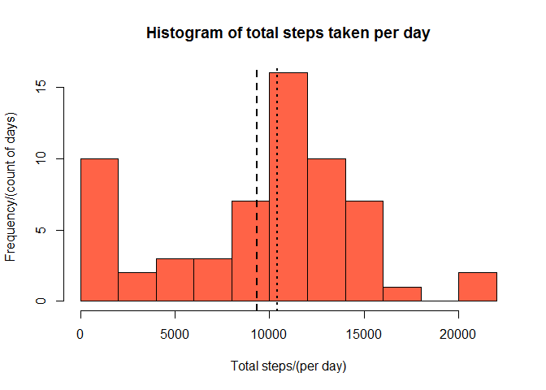
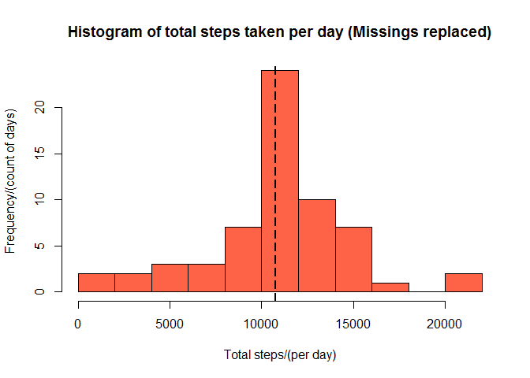
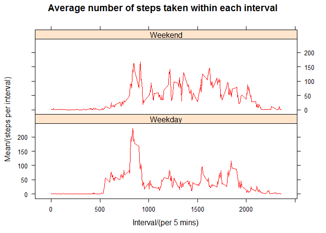

# Reproducible Research: Peer Assessment 1


## Loading and preprocessing the data

First we unzipped the original file, loaded it into r and formatted the date variable as a Date format.


```r
unzip("activity.zip")
dat <- read.csv("./activity.csv", header = TRUE, sep = ",")
dat$date <- as.Date(as.character(dat$date), "%Y-%m-%d")
```

## What is mean total number of steps taken per day?

The histogram below shows the distribution of total number of steps taken per day for the activity dataset.


```r
library(dplyr)
```

```
## Warning: package 'dplyr' was built under R version 3.3.2
```

```r
d1 <- summarise(group_by(dat, date), sum = sum(steps, na.rm = TRUE))
hist(d1$sum, breaks = 10, col = "Tomato", ylab = "Frequency/(count of days)", xlab = "Total steps/(per day)", main = "Histogram of total steps taken per day")
d1mean <- round(mean(d1$sum),0)
d1median <- median(d1$sum)
abline(v = d1mean, lwd = 2, lty = 2)
abline(v = d1median, lwd = 2, lty = 3)
```

<!-- -->

The mean and median total number of steps taken per day is:

**Mean = 9354**
**Median = 10395**

## What is the average daily activity pattern?

To investigate the average daily activity pattern I plotted a time series plot of average number of steps by interval. 


```r
d2 <- summarise(group_by(dat, interval), mean = mean(steps, na.rm = TRUE))
with(d2, plot(interval, mean, type = "l", ylab = "Mean/(steps per interval)", xlab = "Interval/(per 5 mins)", main = "Average number of steps taken within each interval"))
answer <- d2[which.max(d2$mean),][,1]
abline(v = answer, col = "Tomato")
```

-1.png)<!-- -->

On average across all the days in the dataset, the 5-minute interval which has the highest average number of steps is 835 (8:30am).

## Imputing missing values

To caclulate the number of missing values in the data I first ran a summary which showed only the variable 'steps' has missing values. I then used is.na() to calculate how many NA were present and what proportion this is of the whole dataset.


```r
summary(dat)
```

```
##      steps             date               interval     
##  Min.   :  0.00   Min.   :2012-10-01   Min.   :   0.0  
##  1st Qu.:  0.00   1st Qu.:2012-10-16   1st Qu.: 588.8  
##  Median :  0.00   Median :2012-10-31   Median :1177.5  
##  Mean   : 37.38   Mean   :2012-10-31   Mean   :1177.5  
##  3rd Qu.: 12.00   3rd Qu.:2012-11-15   3rd Qu.:1766.2  
##  Max.   :806.00   Max.   :2012-11-30   Max.   :2355.0  
##  NA's   :2304
```

```r
nasum <- sum(is.na(dat$steps))
naper <- mean(is.na(dat$steps))
```

The number of missing values in the steps variable is 2304, which translates to 0.1311475 of the total sample. 

I decided to replace the missing values with the mean value from each interval as follows and create a new dataset d3.


```r
d3 <- dat %>% group_by(interval) %>% mutate(intavg = mean(steps, na.rm = TRUE))

for (i in 1:nrow(d3)){
    
    if (is.na(d3[i,1])==TRUE){
        d3[i,1] <- d3[i,4]}
    else{
        d3[i,2] <- d3[i,2]}
}
```

The new dataset d3 was then used to make a histogram of the total number of steps taken each day, and to calculate the mean and median total number of steps taken per day.


```r
d4 <- summarise(group_by(d3, date), sum = sum(steps, na.rm = TRUE))
hist(d4$sum, breaks = 10, col = "Tomato", ylab = "Frequency/(count of days)", xlab = "Total steps/(per day)", main = "Histogram of total steps taken per day (Missings replaced)")
d4mean <- round(mean(d4$sum),0)
d4median <- round(median(d4$sum),0)
abline(v = d4mean, lwd = 2, lty = 2)
abline(v = d4median, lwd = 2, lty = 3)
```

<!-- -->

The mean and median total number of steps taken per day for the new dataset is:

**Mean = 1.0766\times 10^{4}**
**Median = 1.0766\times 10^{4}**

The values of the mean and median for the new dataset are higher than the values from the orginal dataset. It appears that imputting missing values with the mean of each interval, has caused the mean and median to also allign in the new dataset, showing this replacement has removed some skew in the data distribution.

## Are there differences in activity patterns between weekdays and weekends?

I used the following code on my missing value replaced dataset to create a factor vairable using weekday() function.  I then recoded the factor levels to be either weekday or weekend.


```r
d3$type <- as.factor(weekdays(d3$date))

levels(d3$type) <- list(Weekdays = c("Monday","Tuesday", "Wednesday", "Thursday", "Friday"), Weekends = c("Saturday","Sunday"))
```

To then plot the average number of steps taken per 5-minute interval across weekdays and weekends in one chart, we subsetted the data, grouped by interval and then used summarise to calculate the mean number of steps.


```r
wkday <- d3 %>% subset(type == "Weekdays") %>% group_by(interval) %>% summarise(mean = mean(steps, na.rm = TRUE)) %>% mutate(type = "Weekday")
wkend <- d3 %>% subset(type == "Weekends") %>% group_by(interval) %>% summarise(mean = mean(steps, na.rm = TRUE)) %>% mutate(type = "Weekend")

Tot <- rbind(wkday, wkend)
library(lattice)
```

```
## Warning: package 'lattice' was built under R version 3.3.2
```

```r
xyplot(mean~interval | type, data = Tot, type = "l", pch = 1, col = "red", layout = c(1,2), ylab = "Mean/(steps per interval)", xlab = "Interval/(per 5 mins)", main = "Average number of steps taken within each interval")
```

<!-- -->

There is a clear difference in the mean number of steps taken between weekdays and weekends.  

Weekday data shows an initial large peak before the 1000th interval (10am) Which could well reflect commuting or exercise before work.  

Weekend activity data shows a similar peak pre 10 am however it is not as large as that from the weekday data, perhaps becasue less people have to go to work at weekends and prefer to sleep in. 

From 10am onwards people tend to be more active throughout the day at weekends and active later into the night also.
